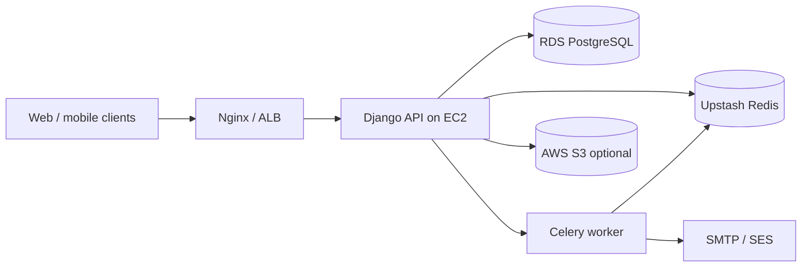

# Social Events API

RESTful backend for discovering, hosting, and attending social events—organizations, ticket tiers, registrations, comments, notifications, JWT and OAuth auth, and Celery-backed async work.

[](https://www.python.org/)
[](https://www.djangoproject.com/)
[](https://www.django-rest-framework.org/)
[](https://www.postgresql.org/)
[](https://upstash.com/)
[](https://docs.celeryq.dev/)
[](https://www.docker.com/)
[](https://aws.amazon.com/)
[](https://drf-spectacular.readthedocs.io/)
[](LICENSE)

---

## Table of contents

- [About](#about)
- [Features](#features)
- [Documentation](#documentation)
- [Tech stack](#tech-stack)
- [Architecture at a glance](#architecture-at-a-glance)
- [Conventions](#conventions)
- [Prerequisites](#prerequisites)
- [Quick start](#quick-start)
- [Configuration](#configuration)
- [API overview](#api-overview)
- [Project structure](#project-structure)
- [Deployment](#deployment)
- [Testing](#testing)
- [Maintaining documentation](#maintaining-documentation)
- [Contributing](#contributing)
- [Security](#security)
- [License](#license)
- [Links](#links)

---

## About

The **Social Events API** is a Django REST Framework application for community and commercial event platforms. Organizers manage organizations and events; attendees register for ticket tiers, comment on events, and receive in-app notifications. The stack is built for **cloud deployment**: Docker on **AWS EC2**, **Amazon RDS PostgreSQL**, **Upstash Redis** (TLS), optional **S3** media, and **Celery** workers for email and background tasks.

| | |
|---|---|
| **Version** | 1.0.0 |
| **Status** | Active development |
| **Primary API prefix** | `/api/v2/` |
| **OpenAPI (Swagger)** | [`/api/docs/`](http://127.0.0.1:8000/api/docs/) (local) |
| **Celery health** | [`/api/celery-health/`](http://127.0.0.1:8000/api/celery-health/) |
| **Repository** | [github.com/alexisTrejo11/social-events-api](https://github.com/alexisTrejo11/social-events-api) |

---

## Features

- **JWT + OAuth** — Email login, refresh rotation, Google/GitHub via django-allauth
- **Events** — Draft/publish/cancel, categories, tags, recurrence, staff roles, favorites, feed
- **Organizations** — Multi-tenant orgs with memberships, invites, and org events
- **Registrations** — Ticket tiers, waitlist, check-in, host-managed attendee lists
- **Engagement** — Threaded comments, likes, host pin/unpin
- **Notifications** — In-app inbox plus HTML email templates
- **Redis namespacing** — `REDIS_KEY_PREFIX=social-events-api:` for shared Upstash instances
- **Rate limiting** — Global middleware + DRF throttles (auth, registration, check-in)
- **Audit logging** — Request middleware with sensitive-field redaction

Full breakdown: **[Project Features](docs/project/generated/ProjectFeature.md)**.

---

## Documentation

Structured portfolio docs live under **`docs/project/`**. Edit YAML frontmatter in **`docs/project/source/`**; read human-friendly output in **`docs/project/generated/`**. The TypeScript contract for downstream tools is **`docs/project/source/schema.ts`**.

### Documentation hub

**Start here:** [**docs/project/generated/README.md**](docs/project/generated/README.md)

### Documentation index

| Document | What you will find | Read |
|----------|-------------------|------|
| **Overview** | Problem, solution, metrics, links | [ProjectOverview.md](docs/project/generated/ProjectOverview.md) |
| **Metadata** | Project id, version, tech stack, URLs | [ProjectMetadata.md](docs/project/generated/ProjectMetadata.md) |
| **API schema** | Endpoints, auth, rate limits, examples | [APISchema.md](docs/project/generated/APISchema.md) |
| **Architecture** | Layers, patterns, diagram, data flows | [ProjectArchitecture.md](docs/project/generated/ProjectArchitecture.md) |
| **Infrastructure** | Docker, EC2, RDS, Upstash, S3 | [ProjectInfrastructure.md](docs/project/generated/ProjectInfrastructure.md) |
| **Features** | Feature cards, snippets, status | [ProjectFeature.md](docs/project/generated/ProjectFeature.md) |
| **Code showcase** | Curated snippets from the codebase | [ProjectCodeShowCase.md](docs/project/generated/ProjectCodeShowCase.md) |

### Source vs generated

| Path | Purpose |
|------|---------|
| `docs/project/source/*.md` | Edit YAML frontmatter here (matches `schema.ts`) |
| `docs/project/generated/*.md` | Read on GitHub / in the IDE — do not edit by hand |
| `docs/project/yaml_to_markdown.py` | Regenerates `docs/project/generated/` from source |

```bash
pip install pyyaml
python docs/project/yaml_to_markdown.py
```

### Additional guides

| Guide | Topic |
|-------|--------|
| [docker/README.md](docker/README.md) | Local vs production Docker Compose |
| [docs/CELERY_GUIDE.md](docs/CELERY_GUIDE.md) | Celery workers, beat, troubleshooting |
| [docs/OAUTH_SETUP.md](docs/OAUTH_SETUP.md) | Google / GitHub OAuth |
| [docs/HTTPS_SETUP.md](docs/HTTPS_SETUP.md) | Nginx + Certbot TLS |

---

## Tech stack

| Layer | Technology |
|-------|------------|
| Runtime | Python 3.11 |
| Framework | Django 5.1.6, Django REST Framework 3.15.2 |
| Auth | djangorestframework-simplejwt, django-allauth, dj-rest-auth |
| API docs | drf-spectacular (OpenAPI 3) |
| Database | PostgreSQL 15 (RDS in production; SQLite in local dev) |
| Cache / broker | Upstash Redis (`rediss://`), django-redis, Celery 5.4 |
| Storage | Optional AWS S3 via django-storages + boto3 |
| Server | Gunicorn, Whitenoise, Nginx (Docker local profile) |
| Containers | Docker Compose (`docker/docker-compose.local.yml`, `docker-compose.prod.yml`) |

Pinned versions: [`requirements.txt`](requirements.txt).

---

## Architecture at a glance

Clients call **HTTPS** → **Nginx / ALB** → **Gunicorn (Django)** → **RDS PostgreSQL**. **Upstash Redis** backs cache, rate limits, and the Celery broker (keys prefixed with `social-events-api:`). Optional **S3** serves uploaded media when `USE_S3=true`.



Details: [ProjectArchitecture.md](docs/project/generated/ProjectArchitecture.md) · [ProjectInfrastructure.md](docs/project/generated/ProjectInfrastructure.md).

---

## Conventions

### Repository layout

- **`apps/<domain>/`** — One Django app per bounded context (`events`, `registrations`, `users`, …).
- **`common/`** — Cross-cutting code (throttling, audit, shared tasks, pagination). Not an `INSTALLED_APPS` entry.
- **`config/settings/`** — `base.py` plus `development.py` (SQLite, debug) and `production.py` (RDS, TLS, S3).

### API

- **Prefix:** Business resources under `/api/v2/`; notifications under `/api/v2/notifications/`.
- **Auth:** `Authorization: Bearer <access_token>` unless documented as public.
- **Docs:** OpenAPI schema at `/api/schema/`, Swagger UI at `/api/docs/`.
- **Slugs:** Events and organizations use `slug` in URLs; registrations and comments nest under `events/{event_slug}/`.

### Environment

- Copy [`.env.example`](.env.example) → `.env`; never commit `.env`.
- **`DJANGO_SETTINGS_MODULE`:** `config.settings.development` for `runserver`; `config.settings.production` for Docker/cloud.
- **`REDIS_KEY_PREFIX`:** Required when sharing Upstash across projects (default `social-events-api:`).

### Code style

- Match existing patterns: thin views, permissions on viewsets, serializers for I/O.
- Prefer explicit `permission_classes` and `throttle_classes` on each view.
- Use `drf-spectacular` `@extend_schema` on public API views where practical.
- Comments only for non-obvious business rules.

### Git

- Branch names: `feature/…`, `fix/…`, `docs/…`.
- Commit messages: imperative mood, short subject (e.g. `Add registration check-in throttle`).
- Regenerate `docs/project/generated/` when changing `docs/project/source/` if docs should render on GitHub without running the script.

---

## Prerequisites

- **Python 3.11+** and `pip`
- **PostgreSQL** and **Redis** for production-like local testing (or use Docker local profile)
- **Docker & Docker Compose** for containerized stack
- **Git**

---

## Quick start

### Local development (SQLite)

```bash
git clone https://github.com/alexisTrejo11/social-events-api.git
cd social-events-api
python3 -m venv .venv
source .venv/bin/activate   # Windows: .venv\Scripts\activate
pip install -r requirements.txt
cp .env.example .env

export DJANGO_SETTINGS_MODULE=config.settings.development
python manage.py migrate
python manage.py runserver
```

| Resource | URL |
|----------|-----|
| Admin | http://127.0.0.1:8000/admin/ |
| Swagger UI | http://127.0.0.1:8000/api/docs/ |
| Celery health | http://127.0.0.1:8000/api/celery-health/ |

Optional: start a Celery worker in another terminal (requires Redis):

```bash
celery -A config worker --loglevel=info
```

### Docker — full local stack

From the repo root (see [docker/README.md](docker/README.md)):

```bash
cp .env.example .env
docker compose -f docker/docker-compose.local.yml up --build
```

| Service | Host port |
|---------|-----------|
| API (via Nginx) | 80 / 443 |
| PostgreSQL | 5431 |
| Redis | 6380 |

### Docker — production profile (EC2)

External RDS + Upstash in `.env`; app container only:

```bash
docker compose -f docker/docker-compose.prod.yml up --build -d
```

Default host mapping: `${PORT:-8000}:8000`.

---

## Configuration

Copy [`.env.example`](.env.example) to `.env`.

| Variable | Description |
|----------|-------------|
| `SECRET_KEY` | Django secret (unique per environment) |
| `DJANGO_SETTINGS_MODULE` | `config.settings.development` or `production` |
| `POSTGRES_*` / `DATABASE_URL` | RDS PostgreSQL in production |
| `REDIS_URL` | Upstash `rediss://…` (cache / results, often DB `1`) |
| `CELERY_BROKER_URL` | Redis broker URL (often DB `0`) |
| `REDIS_KEY_PREFIX` | Key namespace (default `social-events-api:`) |
| `ALLOWED_HOSTS` | Comma-separated API hostnames |
| `FRONTEND_URL` | Frontend base URL for email links |
| `EMAIL_*` | SMTP / SES |
| `USE_S3`, `AWS_*` | Optional S3 media storage |

Production checklist: [ProjectInfrastructure.md](docs/project/generated/ProjectInfrastructure.md).

---

## API overview

| Area | Base path | Generated docs |
|------|-----------|----------------|
| Authentication | `/api/v2/auth/` | [APISchema — auth](docs/project/generated/APISchema.md) |
| OAuth | `/api/v2/auth/oauth/` | [APISchema — oauth](docs/project/generated/APISchema.md) |
| Users & social | `/api/v2/users/` | [APISchema — users](docs/project/generated/APISchema.md) |
| Events | `/api/v2/events/` | [APISchema — events](docs/project/generated/APISchema.md) |
| Organizations | `/api/v2/organizations/` | [APISchema — organizations](docs/project/generated/APISchema.md) |
| Locations | `/api/v2/locations/` | [APISchema — locations](docs/project/generated/APISchema.md) |
| Registrations | `/api/v2/events/{slug}/register/` | [APISchema — registrations](docs/project/generated/APISchema.md) |
| Comments | `/api/v2/events/{slug}/comments/` | [APISchema — comments](docs/project/generated/APISchema.md) |
| Notifications | `/api/v2/notifications/` | [APISchema — notifications](docs/project/generated/APISchema.md) |
| Ops | `/api/celery-health/`, `/api/task-status/` | [APISchema — service](docs/project/generated/APISchema.md) |

**Authentication:** `Authorization: Bearer <access_token>` (JWT).

**Interactive reference:** [http://127.0.0.1:8000/api/docs/](http://127.0.0.1:8000/api/docs/) when running locally.

---

## Project structure

```
social-events-api/
├── apps/                      # Domain Django apps
│   ├── users/                 # Auth, profiles, follow graph, OAuth views
│   ├── organizations/         # Orgs, memberships, invites
│   ├── events/                # Events, categories, tags, roles
│   ├── locations/             # Venues (physical / virtual)
│   ├── registrations/         # Ticket tiers, registrations, check-in
│   ├── comments/              # Event comments, likes, pin
│   └── notifications/         # In-app notifications, email templates
├── common/                    # Throttling, audit, shared Celery tasks
├── config/                    # settings/, urls.py, celery.py, wsgi.py
├── docker/                    # Dockerfile, compose files, nginx/
├── docs/
│   ├── project/
│   │   ├── source/            # YAML source docs (edit)
│   │   ├── generated/         # Readable Markdown (generated) ← hub
│   │   └── yaml_to_markdown.py
│   ├── CELERY_GUIDE.md
│   ├── OAUTH_SETUP.md
│   └── HTTPS_SETUP.md
├── scripts/                   # entrypoint.sh, Celery helpers
├── requirements.txt
├── manage.py
└── .env.example
```

---

## Deployment

Target production layout:

1. **EC2** — Run `docker compose -f docker/docker-compose.prod.yml` (or orchestrate the same image on ECS later).
2. **RDS** — PostgreSQL; set `POSTGRES_HOST` or `DATABASE_URL` in `.env`.
3. **Upstash** — `rediss://` URLs for `REDIS_URL` and `CELERY_BROKER_URL`; set `REDIS_KEY_PREFIX`.
4. **Nginx / ALB** — TLS termination; proxy to container port 8000.
5. **Celery** — Run worker (and beat when periodic tasks are enabled) on EC2 alongside or beside the web container.
6. **S3** — Enable `USE_S3=true` for durable media uploads.

Step-by-step: [docker/README.md](docker/README.md) · [ProjectInfrastructure.md](docs/project/generated/ProjectInfrastructure.md).

---

## Testing

```bash
export DJANGO_SETTINGS_MODULE=config.settings.development
python manage.py test
# or
pytest
```

---

## Maintaining documentation

1. Edit YAML frontmatter in `docs/project/source/<Section>.md` (fields must align with `docs/project/source/schema.ts`).
2. Add human notes **below** the closing `---` in source files (rendered as **Additional notes** in generated output).
3. Regenerate:

   ```bash
   pip install pyyaml
   python docs/project/yaml_to_markdown.py
   ```

4. Commit both `docs/project/source/` and `docs/project/generated/` if GitHub should show docs without running the script.

---

## Contributing

1. Fork [alexisTrejo11/social-events-api](https://github.com/alexisTrejo11/social-events-api)
2. Create a branch (`git checkout -b feature/my-change`)
3. Follow [Conventions](#conventions) and keep changes focused
4. Run tests and regenerate docs if you touched `docs/project/source/`
5. Open a pull request with a clear description

---

## Security

- Do not commit `.env`, credentials, or Upstash/RDS passwords.
- Restrict `/api/celery-health/`, `/api/task-revoke/`, and similar ops routes in production (network ACL or auth).
- Harden organization endpoints with explicit permissions before public launch.
- Set `ALLOWED_HOSTS`, `CORS_ALLOWED_ORIGINS`, and production TLS flags in `config.settings.production`.

Report security issues privately to the repository owner via GitHub Security Advisories or direct contact on your fork’s policy page.

---

## License

MIT — see [LICENSE](LICENSE) when present in the repository.

---

## Links

| Resource | URL |
|----------|-----|
| Repository | https://github.com/alexisTrejo11/social-events-api |
| **Documentation hub** | [docs/project/generated/README.md](docs/project/generated/README.md) |
| OpenAPI (local) | http://127.0.0.1:8000/api/docs/ |
| Production API (placeholder) | https://api.socialevents.placeholder.example.com/api/docs/ |
