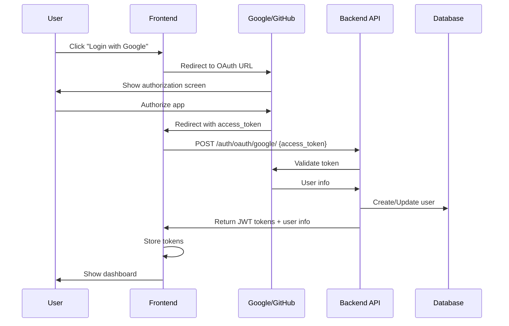

# OAuth2 Setup Guide - Google & GitHub

Esta guía te ayudará a configurar OAuth2 para login con Google y GitHub en tu API.

## 📋 Tabla de Contenidos

1. [Configuración de Google OAuth](#1-configuración-de-google-oauth)
2. [Configuración de GitHub OAuth](#2-configuración-de-github-oauth)
3. [Configuración en Django](#3-configuración-en-django)
4. [Prueba de Endpoints](#4-prueba-de-endpoints)
5. [Integración Frontend](#5-integración-frontend)

---

## 1. Configuración de Google OAuth

### 1.1 Crear un Proyecto en Google Cloud Console

1. Ve a [Google Cloud Console](https://console.cloud.google.com/)
2. Crea un nuevo proyecto o selecciona uno existente
3. Navega a **APIs & Services** → **Credentials**

### 1.2 Configurar OAuth Consent Screen

1. Click en **OAuth consent screen** (menú lateral)
2. Selecciona **External** y click **CREATE**
3. Completa la información requerida:
   - **App name**: Social Events API
   - **User support email**: tu email
   - **Developer contact information**: tu email
4. Click **SAVE AND CONTINUE**
5. En **Scopes**, añade:
   - `userinfo.email`
   - `userinfo.profile`
6. Click **SAVE AND CONTINUE**
7. Añade usuarios de prueba (emails que podrán probar mientras está en testing)
8. Click **SAVE AND CONTINUE**

### 1.3 Crear Credenciales OAuth 2.0

1. Ve a **Credentials** → **+ CREATE CREDENTIALS** → **OAuth client ID**
2. Tipo de aplicación: **Web application**
3. Nombre: **Social Events Web Client**
4. **Authorized JavaScript origins**:
   ```
   http://localhost:3000
   http://localhost:8000
   https://tu-dominio.com (producción)
   ```
5. **Authorized redirect URIs**:
   ```
   http://localhost:8000/accounts/google/login/callback/
   http://localhost:3000/auth/callback/google
   https://tu-dominio.com/accounts/google/login/callback/
   ```
6. Click **CREATE**

### 1.4 Guardar Credenciales

Copia el **Client ID** y **Client Secret** que aparecen en el modal.

**Ejemplo:**
```
Client ID: 123456789-abcdefghijklmnop.apps.googleusercontent.com
Client Secret: GOCSPX-AbCdEfGhIjKlMnOpQrStUvWx
```

---

## 2. Configuración de GitHub OAuth

### 2.1 Crear OAuth App en GitHub

1. Ve a [GitHub Developer Settings](https://github.com/settings/developers)
2. Click en **OAuth Apps** → **New OAuth App**

### 2.2 Completar Información

1. **Application name**: Social Events API
2. **Homepage URL**: 
   ```
   http://localhost:8000
   ```
   (o tu dominio en producción)
3. **Application description**: OAuth login for Social Events platform
4. **Authorization callback URL**:
   ```
   http://localhost:8000/accounts/github/login/callback/
   ```
   Para producción:
   ```
   https://tu-dominio.com/accounts/github/login/callback/
   ```
5. Click **Register application**

### 2.3 Guardar Credenciales

1. Copia el **Client ID**
2. Click en **Generate a new client secret**
3. Copia el **Client Secret** (solo se muestra una vez)

**Ejemplo:**
```
Client ID: Iv1.a1b2c3d4e5f6g7h8
Client Secret: 0123456789abcdef0123456789abcdef01234567
```

---

## 3. Configuración en Django

Hay **dos formas** de configurar las credenciales:

### Opción A: Mediante Django Admin (Recomendado)

#### 3.1 Ejecutar Migraciones

```bash
python manage.py migrate
```

#### 3.2 Crear Superusuario (si no existe)

```bash
python manage.py createsuperuser
```

#### 3.3 Acceder al Admin

1. Inicia el servidor: `python manage.py runserver`
2. Ve a: `http://localhost:8000/admin/`
3. Inicia sesión con tu superusuario

#### 3.4 Configurar Google OAuth

1. En el admin, busca **Sites** → Click en `example.com`
2. Cambia:
   - **Domain name**: `localhost:8000` (o tu dominio)
   - **Display name**: `Social Events`
3. **SAVE**

4. Ve a **Social applications** → **Add Social Application**
5. Completa:
   - **Provider**: `Google`
   - **Name**: `Google OAuth`
   - **Client id**: [Tu Google Client ID]
   - **Secret key**: [Tu Google Client Secret]
   - **Sites**: Selecciona `localhost:8000` (o tu site)
6. **SAVE**

#### 3.5 Configurar GitHub OAuth

1. Ve a **Social applications** → **Add Social Application**
2. Completa:
   - **Provider**: `GitHub`
   - **Name**: `GitHub OAuth`
   - **Client id**: [Tu GitHub Client ID]
   - **Secret key**: [Tu GitHub Client Secret]
   - **Sites**: Selecciona `localhost:8000`
3. **SAVE**

### Opción B: Mediante Variables de Entorno

⚠️ **Próximamente**: Esta funcionalidad requiere configuración adicional.

---

## 4. Prueba de Endpoints

### 4.1 Endpoints Disponibles

```
POST /api/v2/auth/oauth/google/        # Login con Google
POST /api/v2/auth/oauth/github/        # Login con GitHub
GET  /api/v2/auth/oauth/accounts/      # Listar cuentas conectadas
POST /api/v2/auth/oauth/disconnect/    # Desconectar cuenta social
```

### 4.2 Probar con Swagger

1. Ve a: `http://localhost:8000/api/docs/`
2. Expande los endpoints de **OAuth**
3. El flujo completo se hace desde el frontend

### 4.3 Flujo de Autenticación

**Desde tu aplicación frontend:**

1. Redirigir al usuario a Google/GitHub para autorización
2. Usuario autoriza la aplicación
3. Proveedor redirige de vuelta con un `access_token` o `code`
4. Frontend envía el token a tu API:

```javascript
// Ejemplo con Google (después de obtener el access_token)
fetch('http://localhost:8000/api/v2/auth/oauth/google/', {
  method: 'POST',
  headers: {
    'Content-Type': 'application/json',
  },
  body: JSON.stringify({
    access_token: 'ya29.a0AfH6SMB...'  // Token de Google
  })
})
.then(response => response.json())
.then(data => {
  // data contiene: { access, refresh, user }
  localStorage.setItem('access_token', data.access);
  localStorage.setItem('refresh_token', data.refresh);
});
```

---

## 5. Integración Frontend

### 5.1 Flujo Completo



### 5.2 Ejemplo React con Google

```javascript
import { GoogleLogin } from '@react-oauth/google';

function LoginPage() {
  const handleGoogleSuccess = async (credentialResponse) => {
    try {
      const response = await fetch('http://localhost:8000/api/v2/auth/oauth/google/', {
        method: 'POST',
        headers: {
          'Content-Type': 'application/json',
        },
        body: JSON.stringify({
          access_token: credentialResponse.credential
        })
      });
      
      const data = await response.json();
      
      // Guardar tokens
      localStorage.setItem('access_token', data.access);
      localStorage.setItem('refresh_token', data.refresh);
      
      // Redirigir al dashboard
      window.location.href = '/dashboard';
    } catch (error) {
      console.error('Login failed:', error);
    }
  };

  return (
    <GoogleLogin
      onSuccess={handleGoogleSuccess}
      onError={() => console.log('Login Failed')}
    />
  );
}
```

### 5.3 Ejemplo con GitHub

```javascript
// 1. Redirigir a GitHub
const GITHUB_CLIENT_ID = 'tu_client_id';
const REDIRECT_URI = 'http://localhost:3000/auth/callback/github';

function redirectToGitHub() {
  const githubAuthUrl = `https://github.com/login/oauth/authorize?client_id=${GITHUB_CLIENT_ID}&redirect_uri=${REDIRECT_URI}&scope=user:email`;
  window.location.href = githubAuthUrl;
}

// 2. En la página de callback, intercambiar el código
async function handleGitHubCallback() {
  const urlParams = new URLSearchParams(window.location.search);
  const code = urlParams.get('code');
  
  if (code) {
    // Primero, intercambia el código por un access_token
    // (esto normalmente se hace en el backend por seguridad)
    const tokenResponse = await fetch('https://github.com/login/oauth/access_token', {
      method: 'POST',
      headers: {
        'Content-Type': 'application/json',
        'Accept': 'application/json'
      },
      body: JSON.stringify({
        client_id: GITHUB_CLIENT_ID,
        client_secret: 'TU_CLIENT_SECRET', // ⚠️ NO hagas esto en producción
        code: code
      })
    });
    
    const tokenData = await tokenResponse.json();
    
    // Luego envía el access_token a tu API
    const response = await fetch('http://localhost:8000/api/v2/auth/oauth/github/', {
      method: 'POST',
      headers: {
        'Content-Type': 'application/json',
      },
      body: JSON.stringify({
        access_token: tokenData.access_token
      })
    });
    
    const data = await response.json();
    localStorage.setItem('access_token', data.access);
    localStorage.setItem('refresh_token', data.refresh);
  }
}
```

---

## 6. Verificación

### 6.1 Verificar Configuración en Admin

```bash
python manage.py shell
```

```python
from allauth.socialaccount.models import SocialApp

# Verificar apps configuradas
apps = SocialApp.objects.all()
for app in apps:
    print(f"Provider: {app.provider}, Name: {app.name}")
```

### 6.2 Logs

Los logs en `logs/django.log` mostrarán:
- `"OAuth user created/updated via google: user@gmail.com"`
- `"Connected social account google to existing user: user@email.com"`

---

## 7. Solución de Problemas

### Error: "Social app not found"

**Solución**: Verifica que hayas creado la Social Application en Django Admin y que el Site esté configurado correctamente.

### Error: "Invalid access_token"

**Solución**: 
- Verifica que el token no haya expirado
- Asegúrate de enviar el token correcto del proveedor
- Revisa los scopes solicitados

### Error: "Redirect URI mismatch"

**Solución**: Asegúrate de que la URL de callback en Google/GitHub coincida exactamente con la configurada en tu aplicación.

### Usuario no se conecta automáticamente

**Solución**: Verifica que el email del usuario OAuth coincida con algún usuario existente. La conexión automática solo ocurre si los emails coinciden.

---

## 8. Seguridad

### ⚠️ Importante

1. **NUNCA** expongas tus Client Secrets en el frontend
2. **NUNCA** commitees las credenciales al repositorio
3. Usa variables de entorno en producción
4. Habilita HTTPS en producción
5. Configura CORS adecuadamente para tu dominio

### Variables de Entorno Recomendadas

En producción, es mejor usar variables de entorno. Añade a tu `.env`:

```env
# Google OAuth
GOOGLE_OAUTH_CLIENT_ID=tu_client_id
GOOGLE_OAUTH_CLIENT_SECRET=tu_client_secret

# GitHub OAuth
GITHUB_OAUTH_CLIENT_ID=tu_client_id
GITHUB_OAUTH_CLIENT_SECRET=tu_client_secret
```

---

## 9. Referencias

- [Google OAuth2 Documentation](https://developers.google.com/identity/protocols/oauth2)
- [GitHub OAuth Apps Documentation](https://docs.github.com/en/developers/apps/building-oauth-apps)
- [django-allauth Documentation](https://django-allauth.readthedocs.io/)
- [dj-rest-auth Documentation](https://dj-rest-auth.readthedocs.io/)

---

## ✅ Checklist de Configuración

- [ ] Crear proyecto en Google Cloud Console
- [ ] Configurar OAuth Consent Screen en Google
- [ ] Obtener Google Client ID y Secret
- [ ] Crear OAuth App en GitHub
- [ ] Obtener GitHub Client ID y Secret
- [ ] Ejecutar migraciones de Django
- [ ] Configurar Site en Django Admin
- [ ] Crear Social Application para Google en Admin
- [ ] Crear Social Application para GitHub en Admin
- [ ] Probar login con Google desde frontend
- [ ] Probar login con GitHub desde frontend
- [ ] Configurar variables de entorno para producción
